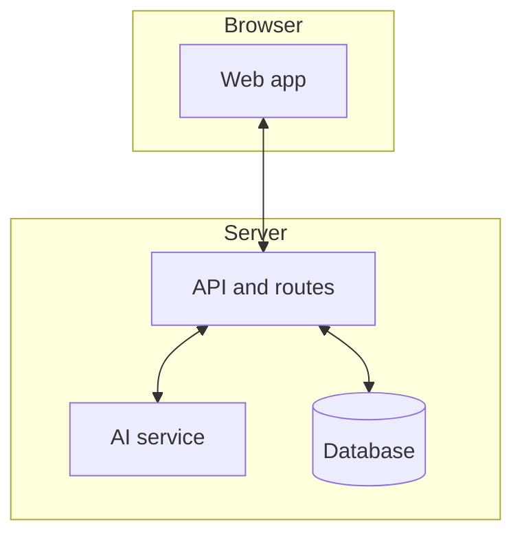

# FloralMind

**Dashboards that think**

FloralMind is an analytics platform where you talk to your data. Instead of static reports, you get a partner that understands your questions, suggests what to look at next, and builds new charts as you explore.

## The idea

Most dashboards are built once and stay fixed. When someone asks "Why did sales drop in the third quarter?" or "Can we see this by region?", a data analyst has to change the report by hand. That is slow and blocks decisions.

FloralMind turns the dashboard into a thinking layer. You upload your data, get an initial set of charts, and then you can:

- Ask questions in plain language
- Click a slice or a bar and go deeper
- Get suggested next steps and possible causes
- See new visualizations generated on the fly

The system uses an AI agent that reads your data, writes the right queries, picks chart types, and returns both the chart and a short explanation. So exploration stays in the flow of how you actually work.

## How it works

**Step 1: Bring your data**

You upload a data file (for example, a spreadsheet export). The platform accepts it and stores it in a small database so it can be queried quickly.

**Step 2: First view in seconds**

FloralMind inspects the columns, spots numbers and categories, and builds a first dashboard. You get summary numbers and a set of charts that make sense for your dataset.

**Step 3: Talk and click**

From there you can type questions such as "Break this down by state" or "Show profit by category." You can also click a part of a chart (a bar, a slice) to drill in. The system turns that into a query, runs it, chooses a chart type, and adds the result to your view. It can also suggest hypotheses and follow-up analyses.

**Step 4: Keep exploring**

Every question or click can add new metrics and charts. The layout grows with your exploration, so you are not stuck in a single predefined report.

End to end: upload, auto dashboard, then conversational and click-based exploration, with the AI handling queries and chart choices in the background.

## Architecture



The web app in the browser sends uploads and questions to the server. The API handles file storage, runs queries on the database, and calls the AI service to interpret questions and choose chart types. Results flow back to the app, which updates the dashboard and chat.

## What you can do

- **Ask in words:** "Why is third quarter lower?" or "Focus only on the South region." The system interprets intent, runs the right query, and shows a chart plus a short insight.
- **Drill by clicking:** Click a segment or bar to go deeper. FloralMind can suggest possible reasons and propose the next analysis, then draw a new visualization.
- **Start from a file:** Upload a dataset and get an initial dashboard and metrics without writing code or building reports manually.
- **Get structure, not guesswork:** The AI reasons over your data shape, plans the query, checks the result, and then renders a chart and explanation.

## Who it is for

- Leaders and managers who want to explore data without waiting on analysts
- Product and sales teams that need fast, flexible views
- Small teams that do not have a dedicated data team
- Larger organizations that want faster iteration on reports and dashboards

## How to run it

Install dependencies, then start the development server:

```bash
npm install
npm run dev
```

Open the app in your browser and upload a data file to create your first dashboard, then use the chat or click on charts to explore.

## Where FloralMind fits

FloralMind is not a generic dashboard builder. It is built from the ground up as a conversational analytics layer: hypothesis ideas, suggested next steps, automatic chart type selection, and drill-down by language or by click. The goal is to reduce back-and-forth with analysts and to make deeper, faster decisions with data.

*FloralMind: dashboards that think.*
